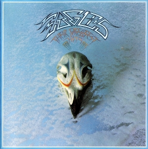
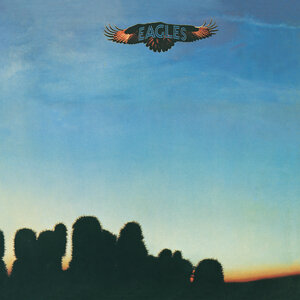

Full-stack developer building what I want, what is cool, and whatever is fun to think about. Love the eagles and a kickstarter superbacker!

## Current Focus

- Building interactive experiences that combine useful interfaces with AI
- Taking ideas from early prototypes to deployed projects
- Improving application architecture, testing, accessibility, and reliability

## Technologies

**Languages:** JavaScript, TypeScript, Python, HTML, CSS

**Frontend:** React, Next.js, Three.js, Vite, Tailwind CSS, WXT

**Backend and APIs:** Node.js, FastAPI, Cloudflare Workers, Anthropic, ElevenLabs, Last.fm, Tavily, Stay22

**Testing and deployment:** Vitest, Jest, Testing Library, Vercel, Render, Cloudflare

## LinkedIn

